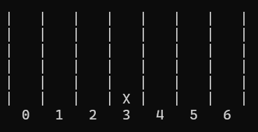
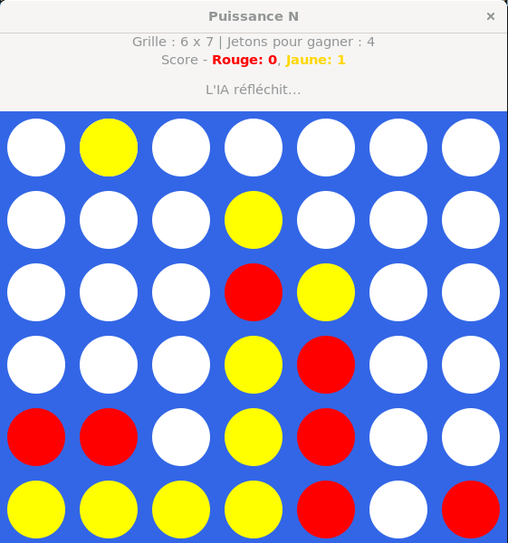

# ProjetIA - Puissance N

Ce projet a pour but d'implémenter une IA sur un jeu.
Nous avons choisi le jeu du Puissance 4 et ensuite l'avons généralisé en Puissance N.

## Structure du projet
<pre markdown>
puissance_n/  
├── include/                          # Fichiers d'en-tête (.h)  
│   ├── ai.h                                   # Prototypes de l'IA (Minimax)  
│   ├── game.h                                 # Fonctions liées au plateau de jeu  
│   └── graphical_interface.h                  # Interface graphique (GTK)  
│  
├── src/                              # Code source (.c)  
│   ├── ai.c                                   # Implémentation de l'IA  
│   ├── game.c                                 # Logique du jeu (init, coup, victoire)  
│   ├── graphical_interface.c                  # Affichage graphique, GTK, animation  
│   └── main.c                                 # Point d’entrée (menu terminal ou graphique)  
│  
├── puissance_n                       # Exécutable compilé  
├── Makefile                          # Script de compilation  
</pre>
  
## Prérequis
  
- **gcc**  
- **pkg-config**  
- **GTK 3**  
  
### Installer avec :

Sur Linux uniquement :
```bash
sudo apt update
sudo apt install pkg-config
sudo apt install build-essential libgtk-3-dev
```

## Compiler le projet 
  
```bash
make
```  


Cela génère un exécutable nommé puissance_n.


## Lancer le programme
  
```bash
./puissance_n
``` 

## Utilisation du programme

### Choix de l'interface
Vous pouvez choisir si vous voulez jouer dans le terminal ou dans une interface graphique.


### Choix du mode de jeu (Joueur VS Joueur ou Joueur VS IA)
Un choix vous est proposé entre jouer contre un vrai joueur (sur le même appareil) ou jouer contre une IA.  


### Paramétrer l'IA
Vous pouvez choisir à quelle profondeur l'IA va tester les coups entre 2 et 6 coups.  
2, car sinon l'IA n'est pas assez performante, et pas au-delà de 6, car avec des plateaux trop grands le temps de réflexion devient trop long pour être jouable.


### Choix des dimensions du plateau de jeu
Vous pouvez choisir vos paramètres personnalisés pour créer votre plateau personnel.  
Avec dimension minimale de 4x4.  
Les dimensions d'un Puissance 4 classique sont :  
lignes = 6 et colonnes = 7


### Choix du nombre de jetons à aligner
Vous pouvez maintenant choisir le nombre de jetons à aligner pour gagner la partie.  
Le minimum est 3 et le maximum est la valeur la plus petite entre le nombre de colonnes et de lignes.


### Phase de jeu dans Terminal
Vous avez juste à entrer la colonne dans laquelle vous voulez mettre votre jeton.




L'IA joue ensuite, et c'est à votre tour de jouer.


Le jeu se déroule jusqu’à ce qu’un joueur gagne ou que le plateau soit rempli.


### Phase de jeu dans GUI

L'interface graphique se compose de deux blocs :
- Les informations du plateau et le score du nombre de parties gagnées par chaque joueur
- Le plateau de jeu 


Passer la souris sur une colonne fait afficher en haut de cette colonne un jeton, pour bien visualiser le coup qui va être joué.


Pour jouer un coup, il suffit de faire un clic gauche avec la souris sur la colonne désirée.


De la même manière que dans le jeu dans le terminal, le jeu se termine :
-   soit quand l’un des joueurs a aligné le nombre de jetons requis
-   soit quand le plateau est plein et que plus aucun jeton ne peut y être joué



Ici l'IA a pu aligner horizontalement 4 jetons alors elle a gagné, et un message s'affiche pour indiquer le vainqueur et proposer de rejouer.


Le score se met à jour après chaque partie remportée par l'un des joueurs.


S'il y a match nul alors La boîte de dialogue le signale et demande si l’on souhaite rejouer, le score ne se met pas à jour dans ce cas-là.


Après avoir terminé de jouer, un récapitulatif des scores est affiché dans le terminal.


## Nettoyer les fichiers objets et exécutables générés 
  
```bash
make clean
``` 

## Auteurs
  
Emilien Derrien  
Clément Oudelet  
Hugo Exertier  
  
